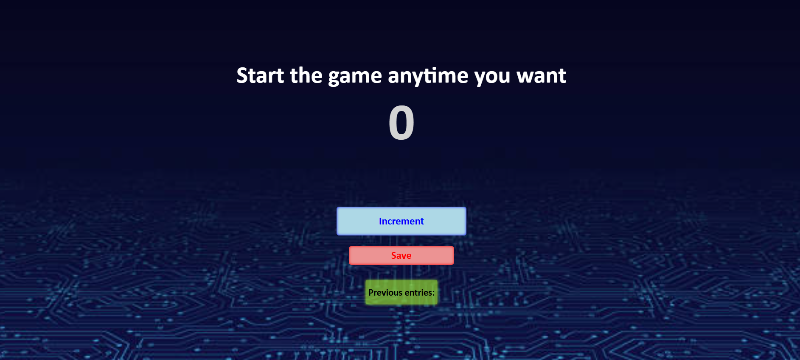

# 🎮 Counter Game (JavaScript Project)
This is my first JavaScript project — a simple and interactive counter game.

The app allows users to:
- Increment a number by clicking a button
- Save the current number
- Display previously saved entries

# Live Demo
- [Live Demo](https://mohammadzali2005.github.io/first-step-js/)

## 🛠️ Technologies Used
- HTML
- CSS
- JavaScript

## Preview 
;

## 🔮 Future Improvements
- Add a reset button
- Store data using localStorage
- Improve UI/UX design
- Add animations